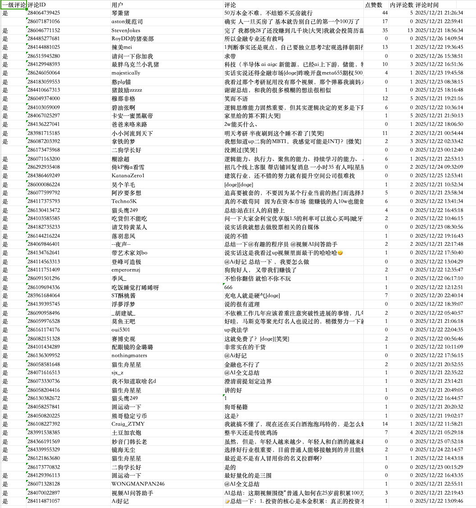
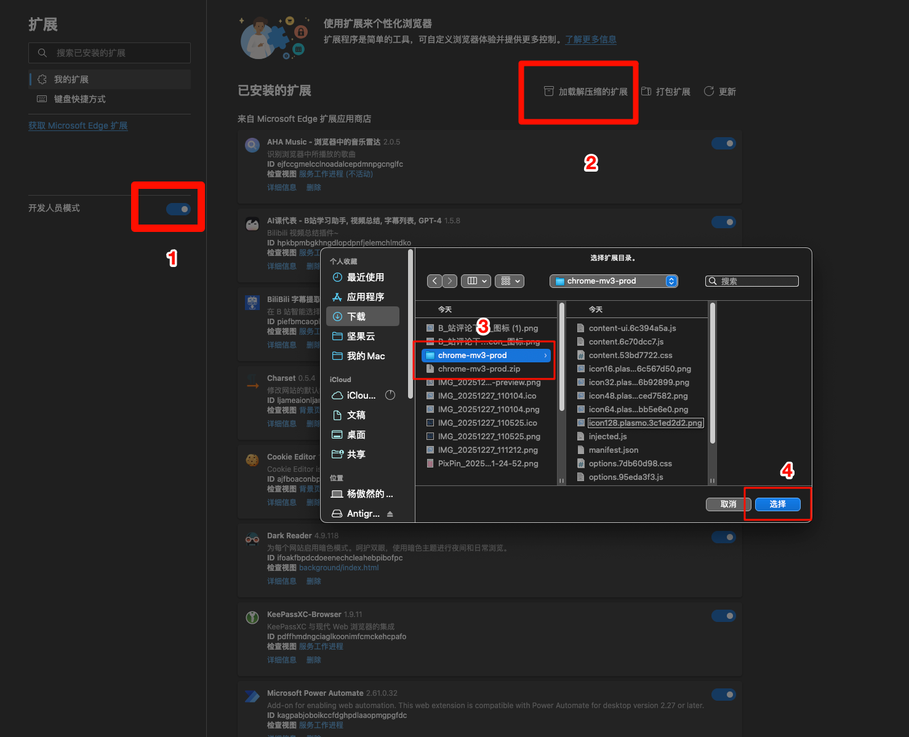

# 原作者
本项目基于原作者开发的bilibili-comments-helper项目，感谢原作者的无私分享。
https://github.com/rictt/bilibili-comments-helper

# 我的修改
改了一些按按钮没反应的bug
将运行和保存分开成两个按钮
添加显示日志，可以直观看到程序是否正常

# 程序截图：

建议使用excel保存模式

# 自己编译教程

npm install
npm run build

# 使用教程
下载release里的压缩包，解压后在浏览器的扩展页面选择导入已解压的压缩包
记得提前开启开发者模式
