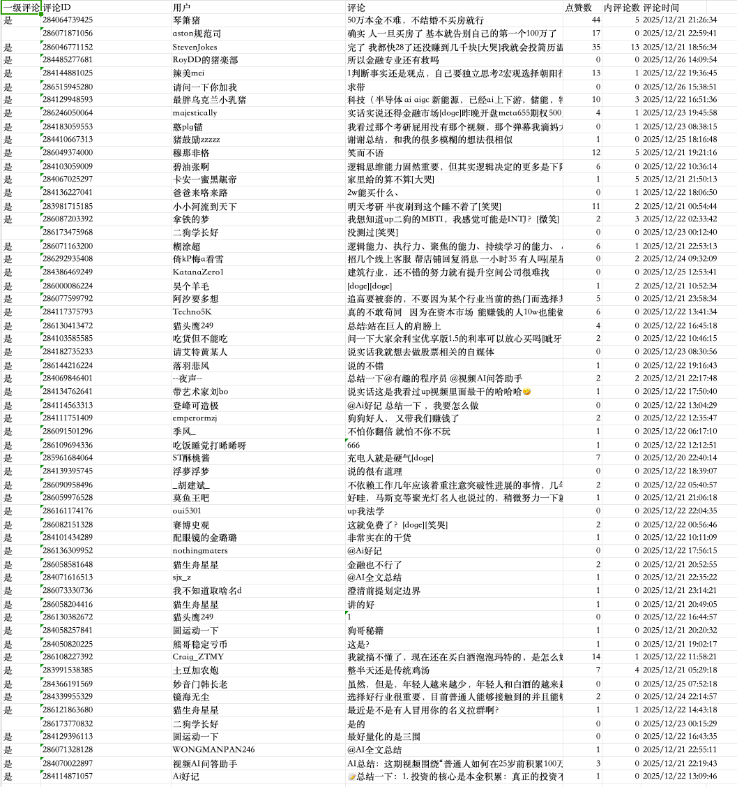
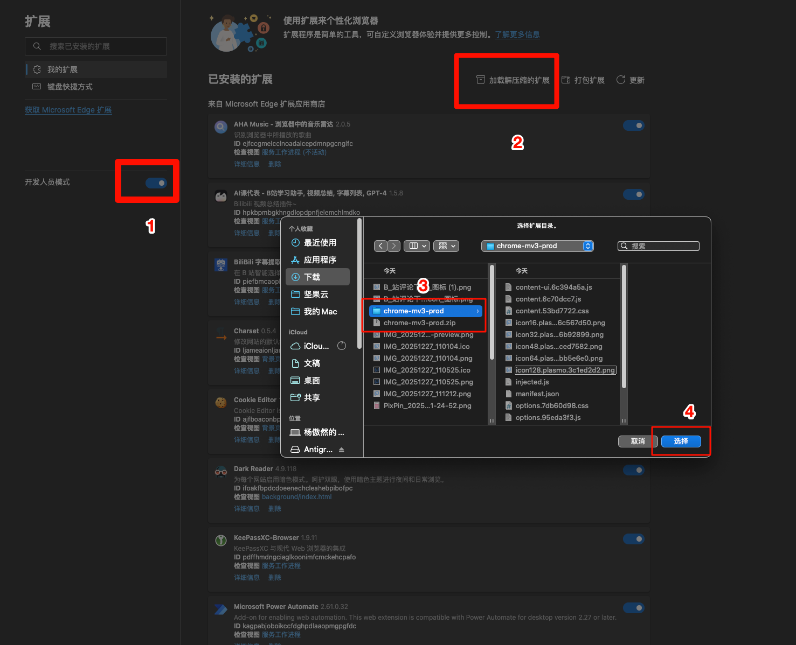

# 📺 Bilibili Comment Downloader | B站评论采集助手 🚀

> 🌟 **一款基于浏览器插件的 Bilibili 视频评论采集、分析与导出工具**
>
> 💖 本项目基于 [rictt/bilibili-comments-helper](https://github.com/rictt/bilibili-comments-helper) 二次开发，修复了部分 BUG 并优化了交互体验。

   

---

## ✨ 主要功能 (Key Features)

*   **📥 评论采集**：支持采集视频的热门评论、最新评论以及**楼中楼（二级评论）**。
*   **📊 数据可视化**：生成的 HTML 报告包含用户性别、等级、VIP状态、IP属地分布等图表分析。
*   **💾 多种导出格式**：
    *   **Excel (.xlsx)**：推荐使用，方便后续整理筛选 📗。
    *   **HTML**：包含交互式图表和完整数据的离线网页 🌐。
*   **🧠 情感与关键词分析**：配合 Python 后端，可进行评论情感分析（积极/消极）及关键词词云提取。
*   **📝 实时日志**：插件界面内置日志窗口，实时查看爬取进度和状态，拒绝"假死" 🕵️‍♂️。
*   **🎯 UI优化**：默认收起状态，点击展开，不影响观看视频体验。
*   **🐒 油猴脚本**：提供Tampermonkey脚本版本，无需安装扩展即可使用。

---

## 🛠️ 本版改进 (Improvements)

相较于原版，本项目主要做了以下优化：

1.  🐛 **修复 BUG**：修复了部分情况下点击按钮无反应的问题。
2.  🔘 **操作分离**：将"运行爬取"和"保存数据"拆分为两个独立步骤，避免误操作丢失数据。
3.  📜 **可视化日志**：添加了日志显示区域，直观看到当前采集了多少条、是否遇到错误等。
4.  📉 **Excel 优化**：优化了 Excel 导出模式的数据结构。
5.  🎯 **UI隐藏功能**：新增隐藏/展开切换，默认收起不影响观看视频。
6.  🐒 **油猴脚本版本**：提供独立的油猴脚本，无需安装扩展即可使用。

---

## 📸 程序截图 (Screenshots)

### 🧩 插件界面与日志
*(建议使用 Excel 保存模式)*


### 🌐 导出结果预览
*(HTML 报告页面，包含 ECharts 图表)*


---

## 🚀 安装与使用教程 (Installation & Usage)

### 方式一：加载已构建包 (推荐小白)

1.  📦 下载本项目 Release 中的压缩包并解压。
2.  🌐 打开 Chrome/Edge 浏览器，进入 **扩展程序页面** (`chrome://extensions/`)。
3.  UI **开启右上角的「开发者模式」**。
4.  📂 点击左上角的 **「加载已解压的扩展程序」**，选择步骤 1 中解压的文件夹。
5.  🎉 安装完成！打开任意 B 站视频页，右侧会出现「评论助手」按钮，点击展开即可使用。



### 方式二：油猴脚本 (Tampermonkey)

如果你已经安装了 Tampermonkey 或 Violentmonkey：

1.  打开 `tampermonkey/bilibili-comments-helper.user.js` 文件。
2.  复制全部内容。
3.  在 Tampermonkey 中创建新脚本并粘贴。
4.  保存后访问 B 站视频页面即可使用。

### 方式三：自己编译 (Development)

如果你是开发者，想自己修改代码：

1.  **环境准备**：确保安装了 [Node.js](https://nodejs.org/)。
2.  **安装依赖**：
    ```bash
    npm install
    ```
3.  **开发模式** (热更新)：
    ```bash
    npm run dev
    ```
4.  **构建生产包**：
    ```bash
    npm run build
    ```
    构建完成后，`build/chrome-mv3-prod` 目录即为可安装的扩展程序包。

---

## 🐍 高级功能：情感与关键词分析 (Backend)

如果你想在 HTML 报告中看到 **情感分析** 和 **关键词统计**，需要运行本地 Python 服务器：

1.  进入 `server` 目录。
2.  安装依赖库：
    ```bash
    pip install flask flask_cors jieba snownlp
    ```
3.  运行服务器：
    ```bash
    python analyse.py
    ```
4.  🏁 此时导出 HTML 并点击"获取完整分析"即可连接本地服务进行 NLP 处理。

---

## 📁 项目结构 (Project Structure)

```
├── contents/
│   ├── content-ui.tsx    # 主UI组件
│   ├── content.ts        # 评论数据处理
│   └── style.module.css  # 样式文件
├── tampermonkey/
│   └── bilibili-comments-helper.user.js  # 油猴脚本版本
├── server/               # Python后端（情感分析）
├── utils.ts              # 工具函数
├── options.tsx           # 设置页面
├── popup.tsx             # 弹窗页面
└── package.json
```

---

## ⚠️ 注意事项 (Disclaimer)

*   🔴 **账号安全**：B站查看评论需要登录。本插件仅对页面展示数据进行汇总，**建议适度使用**，大量高频请求接口可能会导致账号被风控或临时封禁。请自行承担风险！
*   🐢 **性能提示**：使用「爬取含回复」功能时，如果评论数量巨大（如数万条），可能会导致浏览器短暂卡顿，请耐心等待日志滚动。
*   ⚖️ **免责声明**：本项目仅用于学习交流，**请勿用于任何商业用途**。

---

## 📝 更新日志 (Changelog)

### v1.0.2
- 🎯 新增UI隐藏/展开功能，默认收起不影响观看视频
- 🐒 新增油猴脚本版本，无需安装扩展即可使用
- 🐛 修复版本号显示问题
- 🧹 清理调试日志和冗余代码
- 📁 优化项目结构，移动截图到assets目录

---

## 🤝 致谢 (Credits)

*   感谢原作者 [rictt](https://github.com/rictt) 的开源贡献。
*   UI 组件库：Element UI, ECharts.
*   构建工具：Plasmo Framework.

---

**如果觉得好用，请给一个 Star ⭐ 吧！**

反馈联系: qq@throokie.eu.org